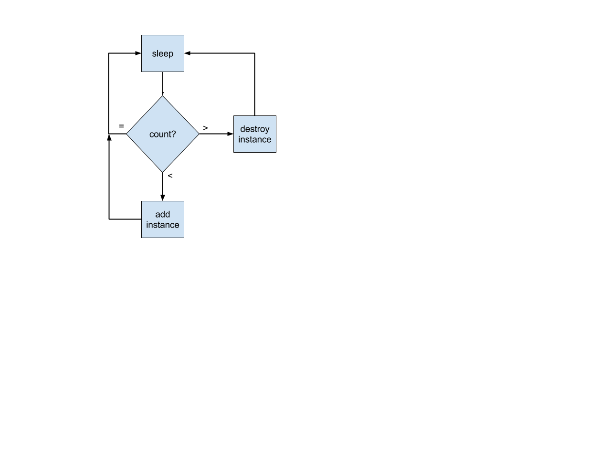
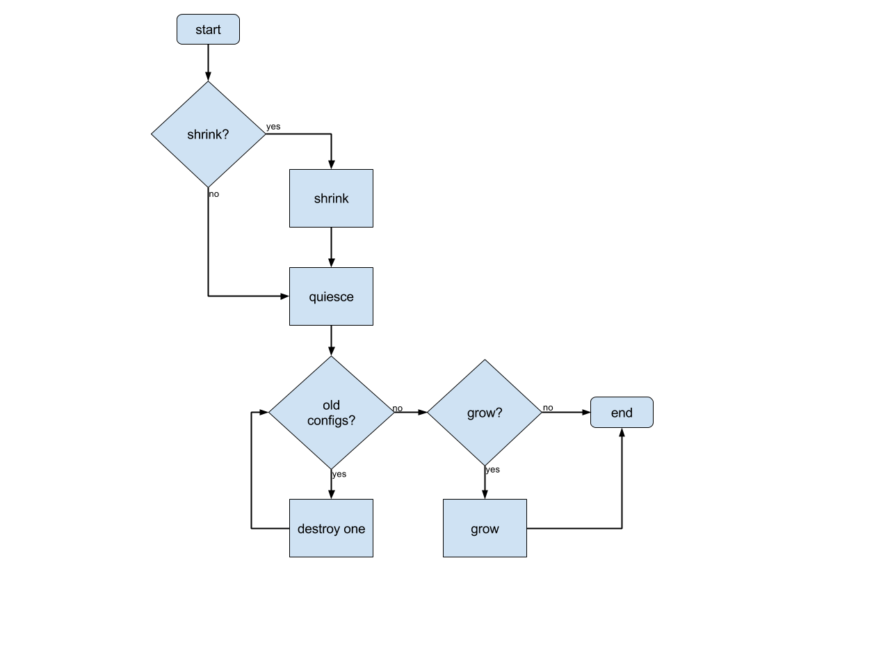

Rolling Updates
===============

## Summary
As one of several machine maintenance primitives, Infrakit will include support for rolling infrastructure updates.  This behavior will be included in the default Group driver.  Alternate Group driver implementations are free to pursue different design goals.

## Use Cases

  + Change the profile of machines in the cluster
  + Update the version of Docker Engine in the cluster

## Constraints
Several existing Infrakit design constraints will shape the machine update implementation.  These include:

### Minimal transactional state
Infrakit currently has one element of central state - the fully-hydrated cluster config file in an object store (e.g. S3 in AWS).  The cluster config file represents the desired state that was most recently dictated by the user.  Where reasonable, this implementation should avoid deviating from this state in a way that detaches the “actual target state” from the “user-declared target state”.

### No guaranteed network access
Network access between various components (other than access required to establish the Swarm cluster).  Therefore out-of-band communication between components should be avoided where reasonable.

### Fungible resources
We assume that no individual cluster participants are unique or irreplaceable.  In fact, the opposite is assumed.  This allows for a higher degree of decoupling of the update routine from the resources being updated.

## Goals

### No hidden state
It is easily to unintentionally design an update system that temporarily alters the state of the cluster such that the user can only access the true declared state via the update system.  We seek to avoid that issue.
Safe steady-state
In the event that an update is interrupted (by the user or a crashed component), the update must mitigate against the update silently continuing.  For example, if the leading Swarm Manager node crashes while an update is in flight, the update will not resume in earnest until receiving a user request.  It is difficult to strictly adhere to this goal while also supporting ‘No hidden state’, as it requires the partially-updated state to be persisted.  As a compromise, we maintain steady state provided that machines are not dying (causing them to be replaced with the latest user-specified configuration).

### Easy rollbacks
We will design primitives and behavior that make it easy for the user to understand what will happen with any given action at any given state.  For example, we will make sure to avoid product design bugs such as “How do I roll back [halt or undo] when rolling back?”.

## Non-goals

We are not looking to support in this initial iteration:

### No automatic rollbacks by default
Prior experience has suggested that automatic rollbacks are error-prone and should encourage the user to make a decision how to proceed.  We should empower users that wish to enable an automatic rollback (for example, upon exceeding a failure threshold).

### No automatic resume
For the reasons of simplicity and predictable behavior, if the controller is stopped for any reason, on start up it will pause the updates until the user re-initiates it.

### No support for canaries
Users may request a canary update mechanism where a small portion of a Group is updated first and ‘baked’.  To minimize product and design complexity, we will encourage these users to utilize other features, such as creating a separate Group to represent canary resources.

### No support for blue-green updates
Blue-green updates can be valuable for the RPC service tier of a system, but likely less so for the infrastructure tier.  Blue-green also requires integration with the load-balancing tier and awareness of Services to switch traffic between the ‘blue’ and ‘green’ sides, which is considered out of scope for Infrakit.

## Design
The cluster config schema includes the concept of instance Groups, representing a pool of homogeneous and fungible resources.  The default Group driver is already responsible for actively monitoring and converging the size of instance Groups towards the size declared in the cluster config configuration.  We will leverage this behavior to implement an update routine that can leverage any Instance driver to perform rolling updates of instances to effect an update to the Group.

Updating a group will be implemented by distinguishing between instances in the ‘desired’ state and those in an ‘undesired state’.  Since Infrakit holds the instructions for creating machines, we tag machines with a hash of this information as a sentinel for the overall machine configuration.

### Scaler
To explain updates, first we must introduce the Scaler.  The Scaler is responsible for converging towards a fixed number of instances in a group.  It periodically polls for the current size of the group and creates or destroys instances as appropriate.  A Scaler is unconcerned with the configuration of the machines it manages, and will not automatically alter instances whose configurations do not match the configurations of machines it creates.  This behavior allows us to meet the “Safe steady-state” goal.

Here is a flow diagram describing the Scaler process:

### Updater
The Updater takes advantage of three properties of the Scaler
when the Scaler’s instance template is changed, the Scaler does not alter any instances
the Scaler always creates instances with the last instance template it was instructed with
the Scaler will continuously converge towards the target group size.  (i.e. if an instance is destroyed, the Scaler will create a new one)

Thanks to these properties, we can implement an update routine that has minimal involvement with the Scaler process itself.  The flow diagram below gives an overview of the update routine.

