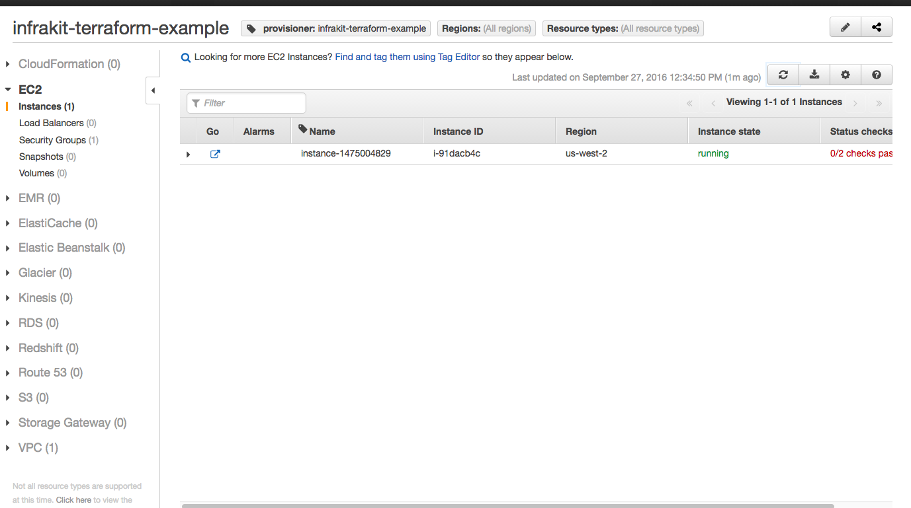
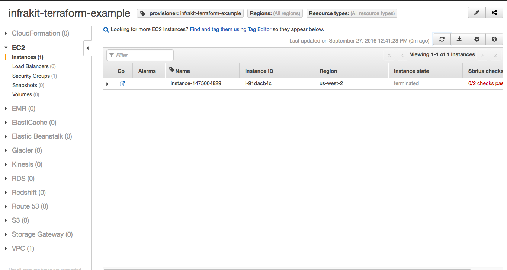

InfraKit Instance Plugin - Terraform
=====================================

A [reference](../../../README.md#reference-implementations) implementation of an Instance Plugin that creates machines
using [Terraform](https://www.terraform.io).  In this concept, InfraKit provides the active group management while
Terraform performs the functions of resource provisioning.

This poc is adapted from the [`aws-two-tier`](https://github.com/hashicorp/terraform/tree/master/examples/aws-two-tier)
example from the Terraform project. There are some minor changes:

  + Variables that required on-screen user interaction (for setting public keys) have been removed
  and replaced with the `key_name` parameter in the provisioning config.
  + The ELB has been removed to keep the example simple -- registration of backends for ELB is
  coming in the future.
  + Removed the output variables which depended on the ELB.

The entire integration can be seen in the file [`plugin.go`](./plugin.go).  Some interesting points:

  + Provisioning via Terraform is simply creating a `.tf.json` file on disk and calling `terraform apply`.
  + `terraform apply` uses a local lock file to make sure only one process is access and updating the
  `.tfstate` file.  This is to avoid concurrent access which can sometimes corrupt the state file.
  In the end, the design is simplified:  we only need to write the files to disk and a dedicated
  goroutine continuously calls `terraform apply`.  
  + The plugin auto-generates names for resources so user doesn't have to.
  + Destroying an instance is simply removing the `.tf.json` file and calling `terraform apply`.
  + Describing instances simply go through all the `instance-X.tf.json` files on disk and returns them
  as the result. This is a pretty simplistic integration but it is more correct than writing files
  and then reading the `tfstate` file.  The generated tf json file instances are essentially
  "promises" that terraform will eventually provision. A tighter integration is worth investigation.

[Here](./cattle_demo.md) is a simple demo of using Terraform with group and Vanilla plugins.

## Configuration

This directory contains a `main.tf` that builds a VPC with subnet on AWS.  EC2 instances
(or `aws_instance` resource) are then added to the config as separate files when the plugin provisions
the resource.  For an EC2 instance this is a valid `.tf.json`:

```json
{
    "resource": {
      "aws_instance": {
        "instance-1474957906": {
          "ami": "${lookup(var.aws_amis, var.aws_region)}",
          "instance_type": "m1.small",
          "key_name": "PUBKEY",
          "subnet_id": "${aws_subnet.default.id}",
          "tags": {
            "InstancePlugin": "terraform",
            "Tier": "web",
            "other": "values"
          },
          "user_data": "#!/bin/sh; echo 'hello world'",
          "vpc_security_group_ids": [
            "${aws_security_group.default.id}"
          ],
          "connection": {
            "user": "ubuntu"
          }
        }
      }
    }
  }
```

Terraform's configuration schema requires user assignment of names for individual resources, while
InfraKit operates on groups of them.  So we changed the JSON format slightly to require only the
resource type name (e.g. `aws_instance`).  This is the spec for the instance plugin:

```json
{
    "Properties" : {
        "type" : "aws_instance",
        "value" : {
            "ami" : "${lookup(var.aws_amis, var.aws_region)}",
            "instance_type" : "m1.small",
            "key_name": "PUBKEY",
            "vpc_security_group_ids" : ["${aws_security_group.default.id}"],
            "subnet_id": "${aws_subnet.default.id}",
            "tags" :  {
                "Tier" : "web",
                "InstancePlugin" : "terraform"
            },
            "connection" : {
                "user" : "ubuntu"
            }
        }
    },
    "Tags" : {
        "other" : "values"
    },
    "Init" : "#!/bin/sh; sudo apt-get -y update; sudo apt-get -y install nginx; sudo service nginx start"
}
```

For validation of input, the plugin only checks for validity of the JSON blob in the `Properties` field
above.  Note that there are two properties of importance: `type` and `value`.  `type` is the resource
type in terraform (in this case `aws_instance`, but can also be other resource types, as long as it's
something that makes sense with the environment provisioned in `main.tf`.

When provisioning, the plugin assigns a name first and then generates a valid `tf.json`.  `terraform apply`
is run continuously in the background so as soon as new files are deposited, Terraform will provision
and update its state.  When an instance is removed, Terraform will do the same by destroying the instance
and update its state.

 
## Running

Begin by building plugin [binaries](../../../README.md#binaries).

The plugin requires a directory (`--dir`) that will be used to contain the `tfstate` and `tf.json`
files.  It also checks to make sure it can call `terraform`.
Install Terraform [here](https://www.terraform.io/downloads.html) if you haven't done so.

See the [CLI Doc](/cmd/cli/README.md) for details on accessing the instance plugin via CLI.

Start the plugin:

```shell
$ build/infrakit-instance-terraform --dir=./example/instance/terraform/aws-two-tier/
INFO[0000] Listening at: ~/.infrakit/plugins/instance-terraform
```

Be sure to verify that the plugin is [discoverable](../../../cmd/cli/README.md#list-plugins).

Now lets try to validate something.  Instead of reading from stdin we are loading from a file
to avoid problems with bad bash substitution beacuse Terrafrom configs use `$` to indicate variables.

```shell
$ cat example/instance/terraform/aws-two-tier/instance-plugin-properties.json
{
    "type" : "aws_instance",
    "value" : {
        "ami" : "${lookup(var.aws_amis, var.aws_region)}",
        "instance_type" : "m1.small",
        "key_name": "PUBKEY",
        "vpc_security_group_ids" : ["${aws_security_group.default.id}"],
        "subnet_id": "${aws_subnet.default.id}",
        "tags" :  {
            "Tier" : "web",
            "InstancePlugin" : "terraform"
        },
        "connection" : {
            "user" : "ubuntu"
        }
    }
}
$ build/infrakit instance --name instance-terraform validate example/instance/terraform/aws-two-tier/instance-plugin-properties.json
validate:ok
```

Now we can provision:

```shell
$ cat example/instance/terraform/aws-two-tier/instance-plugin-spec.json
{
    "Properties" : {
        "type" : "aws_instance",
        "value" : {
            "ami" : "${lookup(var.aws_amis, var.aws_region)}",
            "instance_type" : "m1.small",
            "key_name": "PUBKEY",
            "vpc_security_group_ids" : ["${aws_security_group.default.id}"],
            "subnet_id": "${aws_subnet.default.id}",
            "tags" :  {
                "Tier" : "web",
                "InstancePlugin" : "terraform"
            },
            "connection" : {
                "user" : "ubuntu"
            }
        }
    },
    "Tags" : {
        "other" : "values"
    },
    "Init" : "#!/bin/sh; sudo apt-get -y update; sudo apt-get -y install nginx; sudo service nginx start"
}
$ build/infrakit instance --name instance-terraform provision example/instance/terraform/aws-two-tier/instance-plugin-spec.json
instance-1475004829
```

Now list them.

```shell
$ build/infrakit instance --name instance-terraform describe
ID                            	LOGICAL                       	TAGS
instance-1475004829           	  -                           	other=values,provisioner=infrakit-terraform-example,InstancePlugin=terraform,Name=instance-1475004829,Tier=web
```

You should verify that the instances are indeed created in the AWS Console.
In AWS Console you can filter by tag `provisioner` with value `infrakit-terraform-example`:



Now destroy the instance:

```shell
$ build/infrakit instance --name instance-terraform destroy instance-1475004829
destroyed instance-1475004829
$ build/infrakit instance --name instance-terraform describe
ID                            	LOGICAL                       	TAGS
```


