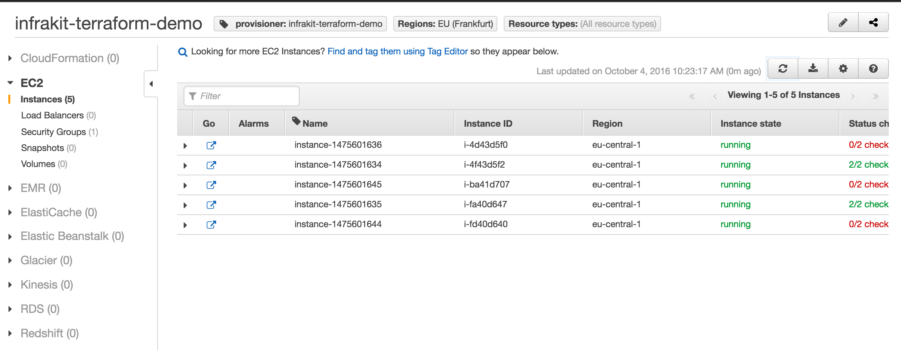
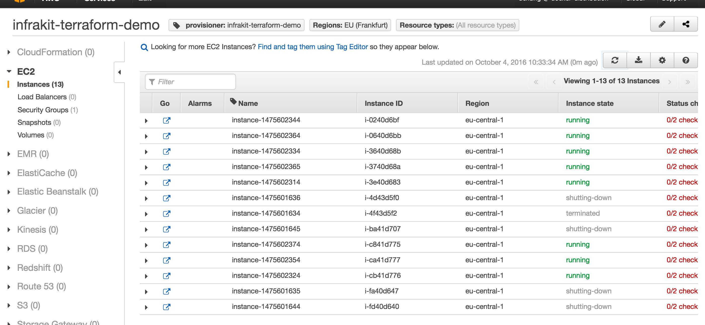

A Simple Group Demo with Terraform
==================================

This demo combines the Terraform instance plugin and a simple vanilla plugin
to provision instances in AWS.  The Terraform configurations are found in the directory [`aws-two-tier`](./aws-two-tier).

## 1. The group config

the file [`example/instance/terraform/aws-two-tier/group.json`)(./example/instance/terraform/aws-two-tier/group.json)
shows a simple group of cattle nodes provisioned using Terraform:

```json
{
    "ID": "terraform_demo",
    "Properties": {
        "Instance": {
            "Plugin": "instance-terraform",
            "Properties": {
                "type": "aws_instance",
                "value": {
                    "ami": "${lookup(var.aws_amis, var.aws_region)}",
                    "instance_type": "t2.micro",
                    "key_name": "chungers-ssh",
                    "vpc_security_group_ids": ["${aws_security_group.default.id}"],
                    "subnet_id": "${aws_subnet.default.id}",
                    "tags":  {
                        "Tier": "web",
                        "provisioner": "infrakit-terraform-demo"
                    },
                    "connection": {
                        "user": "ubuntu"
                    }
                }
            }
        },
        "Flavor": {
            "Plugin": "flavor-vanilla",
            "Properties": {
                "Size": 5,
                "Init": [
                    "sudo apt-get update -y",
                    "sudo apt-get install -y nginx",
                    "sudo service nginx start"
                ]
            }
        }
    }
}
```

## 2. Start the plugins

From the top level directory of the project:

```shell
# The instance plugin:
$ build/infrakit-instance-terraform --dir $(pwd)/example/instance/terraform/aws-two-tier/
```

```shell
# The group plugin
$ build/infrakit-group-default
```

```shell
# The vanilla flavor
$ build/infrakit-flavor-vanilla
```

## 3. List all the instances

```shell
$ build/infrakit instance --name=instance-terraform describe
ID                                                LOGICAL                               TAGS
# no instances
```
## 4.  Start watching!

Using the JSON we showed above, start watching this group:

```shell
$ build/infrakit group watch example/instance/terraform/aws-two-tier/group.json
watching terraform_demo
```
The group plugin starts to create new instances to match the specification.
In the AWS console using `infrakit-terraform-demo` as tag filter, we find 
these instances 

## 5. List members
```shell
$ build/infrakit group inspect terraform_demo
ID                              LOGICAL                         TAGS
instance-1475601644               -                             Name=instance-1475601644,Tier=web,infrakit.config_sha=BmjtnDnrqBvGHm05Nin3Vb66NaA=,infrakit.group=terraform_demo,provisioner=infrakit-terraform-demo
instance-1475601645               -                             Name=instance-1475601645,Tier=web,infrakit.config_sha=BmjtnDnrqBvGHm05Nin3Vb66NaA=,infrakit.group=terraform_demo,provisioner=infrakit-terraform-demo
instance-1475601634               -                             Name=instance-1475601634,Tier=web,infrakit.config_sha=BmjtnDnrqBvGHm05Nin3Vb66NaA=,infrakit.group=terraform_demo,provisioner=infrakit-terraform-demo
instance-1475601635               -                             Name=instance-1475601635,Tier=web,infrakit.config_sha=BmjtnDnrqBvGHm05Nin3Vb66NaA=,infrakit.group=terraform_demo,provisioner=infrakit-terraform-demo
instance-1475601636               -                             Name=instance-1475601636,Tier=web,infrakit.config_sha=BmjtnDnrqBvGHm05Nin3Vb66NaA=,infrakit.group=terraform_demo,provisioner=infrakit-terraform-demo
```

## 6. Update the config
Let's change the size to 8 and the instance type to `t2.nano`.  

Before we run we can check to see what will be done:

```shell
$ build/infrakit group describe example/instance/terraform/aws-two-tier/group.json
terraform_demo : Performs a rolling update on 5 instances, then adds 3 instances to increase the group size to 8
```

Looks good.  Let's commit:

```shell
$ build/infrakit group update example/instance/terraform/aws-two-tier/group.json
update terraform_demo completed
```

## 7. Check on the group:

```shell
$ build/infrakit group inspect terraform_demo
ID                              LOGICAL                         TAGS
instance-1475602365               -                             Name=instance-1475602365,Tier=web,infrakit.config_sha=NP0kIk4bVoojdRZsRGC0XKTrrUs=,infrakit.group=terraform_demo,provisioner=infrakit-terraform-demo
instance-1475602374               -                             Name=instance-1475602374,Tier=web,infrakit.config_sha=NP0kIk4bVoojdRZsRGC0XKTrrUs=,infrakit.group=terraform_demo,provisioner=infrakit-terraform-demo
instance-1475602314               -                             Name=instance-1475602314,Tier=web,infrakit.config_sha=NP0kIk4bVoojdRZsRGC0XKTrrUs=,infrakit.group=terraform_demo,provisioner=infrakit-terraform-demo
instance-1475602324               -                             Name=instance-1475602324,Tier=web,infrakit.config_sha=NP0kIk4bVoojdRZsRGC0XKTrrUs=,infrakit.group=terraform_demo,provisioner=infrakit-terraform-demo
instance-1475602334               -                             Name=instance-1475602334,Tier=web,infrakit.config_sha=NP0kIk4bVoojdRZsRGC0XKTrrUs=,infrakit.group=terraform_demo,provisioner=infrakit-terraform-demo
instance-1475602344               -                             Name=instance-1475602344,Tier=web,infrakit.config_sha=NP0kIk4bVoojdRZsRGC0XKTrrUs=,infrakit.group=terraform_demo,provisioner=infrakit-terraform-demo
instance-1475602354               -                             Name=instance-1475602354,Tier=web,infrakit.config_sha=NP0kIk4bVoojdRZsRGC0XKTrrUs=,infrakit.group=terraform_demo,provisioner=infrakit-terraform-demo
instance-1475602364               -                             Name=instance-1475602364,Tier=web,infrakit.config_sha=NP0kIk4bVoojdRZsRGC0XKTrrUs=,infrakit.group=terraform_demo,provisioner=infrakit-terraform-demo
```
Note the new SHA of the instances.

Also, in the console: 

You can also try to remove some instances and see that the group size will be restored shortly.

## 8. Tear everything down

We are done with the demo, remove the resources...

```shell
$ build/infrakit group destroy terraform_demo
destroy terraform_demo initiated
```
