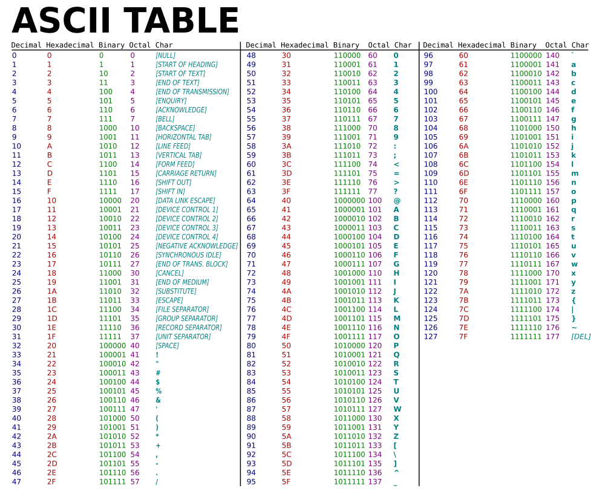

# asciiset

[](https://pkg.go.dev/github.com/elliotwutingfeng/asciiset)
[](https://goreportcard.com/report/github.com/elliotwutingfeng/asciiset)
[](https://codecov.io/gh/elliotwutingfeng/asciiset)

[](LICENSE)

## Summary

**asciiset** is an [ASCII](https://simple.wikipedia.org/wiki/ASCII) character bitset.

Bitsets are fast and memory-efficient data structures for storing and retrieving information using bitwise operations.

**asciiset** is an extension of the **asciiSet** data structure from the Go Standard library [source code](https://cs.opensource.google/go/go/+/master:src/bytes/bytes.go).

Possible applications include checking strings for prohibited ASCII characters, and counting unique ASCII characters in a string.

Spot any bugs? Report them [here](https://github.com/elliotwutingfeng/asciiset/issues).



## Installation

```bash
go get github.com/elliotwutingfeng/asciiset
```

## Testing

```bash
make tests

# Alternatively, run tests without race detection
# Useful for systems that do not support the -race flag like windows/386
# See https://tip.golang.org/src/cmd/dist/test.go
make tests_without_race
```

## Benchmarks

```bash
make bench
```

### Results

```text
CPU: AMD Ryzen 7 5800X
Time in nanoseconds (ns) | Lower is better

ASCIISet

     Add() ▏  891 🟦🟦🟦 11x faster

Contains() ▏  580 🟦🟦 28x faster

  Remove() ▏ 1570 🟦🟦🟦🟦 1.5x faster

    Size() ▏  313 🟦 equivalent

   Visit() ▏ 1421 🟦🟦🟦🟦 3.5x faster

map[byte]struct{}

     Add() ▏ 9850 🟥🟥🟥🟥🟥🟥🟥🟥🟥🟥🟥🟥🟥🟥🟥🟥🟥🟥🟥🟥🟥🟥🟥🟥

Contains() ▏16605 🟥🟥🟥🟥🟥🟥🟥🟥🟥🟥🟥🟥🟥🟥🟥🟥🟥🟥🟥🟥🟥🟥🟥🟥🟥🟥🟥🟥🟥🟥🟥🟥🟥🟥🟥🟥🟥🟥🟥🟥

  Remove() ▏ 2510 🟥🟥🟥🟥🟥🟥

    Size() ▏  318 🟥

   Visit() ▏ 5085 🟥🟥🟥🟥🟥🟥🟥🟥🟥🟥🟥🟥🟥
```

```bash
go test -bench . -benchmem -cpu 1
goos: linux
goarch: amd64
pkg: github.com/elliotwutingfeng/asciiset
cpu: AMD Ryzen 7 5800X 8-Core Processor
BenchmarkASCIISet/ASCIISet_Add()                 1340958               891.8 ns/op             0 B/op          0 allocs/op
BenchmarkASCIISet/ASCIISet_Contains()            2058140               580.9 ns/op             0 B/op          0 allocs/op
BenchmarkASCIISet/ASCIISet_Remove()               762636              1570 ns/op               0 B/op          0 allocs/op
BenchmarkASCIISet/ASCIISet_Size()                3808866               313.2 ns/op             0 B/op          0 allocs/op
BenchmarkASCIISet/ASCIISet_Visit()                840808              1421 ns/op               0 B/op          0 allocs/op
BenchmarkMapSet/map_Add                           122043              9850 ns/op               0 B/op          0 allocs/op
BenchmarkMapSet/map_Contains                       72583             16605 ns/op               0 B/op          0 allocs/op
BenchmarkMapSet/map_Remove                        451785              2510 ns/op               0 B/op          0 allocs/op
BenchmarkMapSet/map_Size                         3789381               318.3 ns/op             0 B/op          0 allocs/op
BenchmarkMapSet/map_Visit                         235515              5085 ns/op               0 B/op          0 allocs/op
PASS
ok      github.com/elliotwutingfeng/asciiset    14.438s
```
